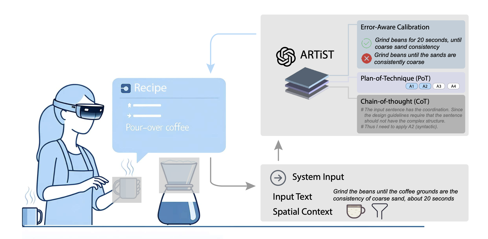

# ARTiST: Automated Text Simplification for Task Guidance in Augmented Reality
[[ACM DL]](https://dl.acm.org/doi/fullHtml/10.1145/3613904.3642772) [[Arxiv]](https://arxiv.org/pdf/2402.18797)

Guande Wu, Jing Qian, Sonia Castelo Quispe, Shaoyu Chen, João Rulff, and Claudio Silva. 2024. ARTiST: Automated Text Simplification for Task Guidance in Augmented Reality. In Proceedings of the CHI Conference on Human Factors in Computing Systems (CHI '24). Association for Computing Machinery, New York, NY, USA, Article 939, 1–24. https://doi.org/10.1145/3613904.3642772


Text presented in augmented reality provides in-situ, real-time information for users. However, this content can be challenging to apprehend quickly when engaging in cognitively demanding AR tasks, especially when it is presented on a head-mounted display. We propose ARTiST, an automatic text simplification system that uses a few-shot prompt and GPT-3 models to specifically optimize the text length and semantic content for augmented reality. Developed out of a formative study that included seven users and three experts, our system combines a customized error calibration model with a few-shot prompt to integrate the syntactic, lexical, elaborative, and content simplification techniques, and generate simplified AR text for head-worn displays. Results from a 16-user empirical study showed that ARTiST lightens the cognitive load and improves performance significantly over both unmodified text and text modified via traditional methods. Our work constitutes a step towards automating the optimization of batch text data for readability and performance in augmented reality.

Method overview: ARTiST uses OpenAI’s GPT-3 model, prompted with chain-of-thought and technique-as-plan methods, to generate simplified text candidates. The candidates are calibrated to reduce the likelihood of potential errors. The resulting simplified text is then displayed within a HoloLens 2 application. The spatial context is captured by detecting the objects in the scene to support the elaborative simplification.


## Usage
Run the Flask application
```
python app.py
```
The application will start and be accessible at http://127.0.0.1:5000. Send a POST request to the /process endpoint with a JSON payload containing the text and objects keys. For example:
```
curl -X POST http://127.0.0.1:5000/process \
     -H "Content-Type: application/json" \
     -d '{"text": "Describe a sunset", "objects": ["sky", "sun", "horizon"]}'
```
